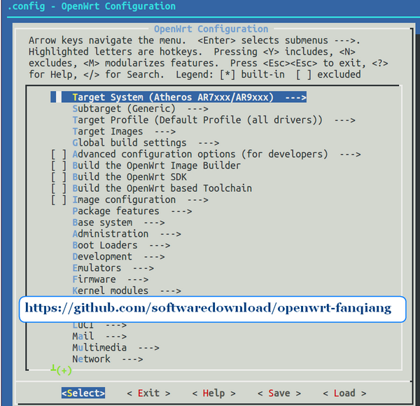

编译shadowsocks-libev for OpenWrt ipk安装包
=========================================

不同OpenWrt版本下编译的shadowsocks-libev ipk一般是不能通用的。比如现在用的是trunk版的OpenWrt，如果使用OpenWrt Chaos Calmer 15.05 下编译的shadowsocks-libev，可能安装后根本不能启动。

前面我曾编译出翻墙固件，其中shadowsocks-libev是别人编译，从sourceforge上下载的，刷上固件后，shadowsocks总是没有自动启动，运行/usr/bin/ss-redir，报告没有找到这个文件，其实文件是在的，只是不兼容。所以，最好还是自行编译shadowsocks-libev。

以下 **不要使用root用户来操作**

下面是在Ubuntu 64bit下编译shadowsocks-libev for OpenWrt ipk安装包的步骤：

## 安装依赖库，不同的操作系统版本可能要作相应调整
	sudo apt-get install build-essential subversion libncurses5-dev zlib1g-dev gawk gcc-multilib flex git-core gettext

## 下载OpenWrt源代码
	cd ~/Downloads
	git clone git://git.openwrt.org/openwrt.git

## 下载shadowsocks-libev源码

	cd ~/Downloads/openwrt
	pushd package
	git clone https://github.com/shadowsocks/shadowsocks-libev.git
	popd

或者：
	
	cd ~/Downloads/openwrt/package
	git clone https://github.com/shadowsocks/shadowsocks-libev.git
	
	编译 DIR505固件2015-12版时用的源码版本是：Date:   Tue Dec 22 21:42:40 2015

## 更新Feeds，使package在make menuconfig中可用，而不是真正安装或编译
	cd ~/Downloads/openwrt
	./scripts/feeds update -a
	./scripts/feeds install -a	
	make defconfig
	
## 先编译要用到的工具和库

	make prereq && make tools/install && make toolchain/install

等待时间较长，可以先和大妈一起去跳个广场舞，制造更多噪音恶心一下别人:)

## make menuconfig配置选项
	# 运行命令
	make menuconfig

有三个选项：
- y: 编译进固件
- m: 编译出安装包，但不打包进固件
- n: 排除
	

输入命令`make menuconfig`进入配置程序后：

- Target System: 
	* Atheros AR7xxx/AR9XXX  (Default value，不同的路由器，可能选择不同)  
		适合： WNDR4300, DIR505A1, TLWR2543
- Subtarget: 
	* Generic device with NAND flash  
		适合： WNDR4300
	* Generic  
		适合： DIR505A1
- Target Profile: (因我们只是编译包，这步可以不选)
- Network, 选择shadowsocks-libev 和 shadowsocks-libev-polarssl,  按m设置为编译独立ipk安装包
- Save && Exit
			
  
图 make menuconfig

  
图　选择shadowsocks-libev-polarssl								
										
														
## 编译shadowsocks-libev for OpenWrt
	make V=99 package/shadowsocks-libev/openwrt/compile	
	
## 查看编译出的shadowsocks-libev和shadowsocks-libev-polarssl文件
	
	cd ~/Downloads/openwrt/bin/ar71xx/packages/base/
	tree
	├── libc_1.1.11-1_ar71xx.ipk
	├── libgcc_5.2.0-1_ar71xx.ipk
	├── libopenssl_1.0.2e-1_ar71xx.ipk
	├── libpolarssl_1.3.15-1_ar71xx.ipk
	├── libpthread_1.1.11-1_ar71xx.ipk
	├── shadowsocks-libev_2.4.3_ar71xx.ipk
	├── shadowsocks-libev-polarssl_2.4.3_ar71xx.ipk
	└── zlib_1.2.8-1_ar71xx.ipk	
	
	# 如果用来编译翻墙固件，把shadowsocks-libev复制到Image Builder目录下：	
	# for DIR505A1:
	cp shadowsocks* ~/Downloads/OpenWrt-ImageBuilder-ar71xx-generic.Linux-x86_64/packages/base
	# for WNDR4300
	cp shadowsocks* ~/Downloads/OpenWrt-ImageBuilder-ar71xx-nand.Linux-x86_64/packages/base
	
	
把文件scp复制到OpenWrt路由器/tmp，就可以　`opkg install shadowsocks-libev_2.4.3_ar71xx.ipk`　安装了。
	
#### 参考：
- http://wiki.openwrt.org/doc/howto/buildroot.exigence
- http://wiki.openwrt.org/doc/howto/build
- https://github.com/shadowsocks/shadowsocks-libev
- http://sourceforge.net/projects/openwrt-dist/files/shadowsocks-libev/
- https://0066.in/archives/312
